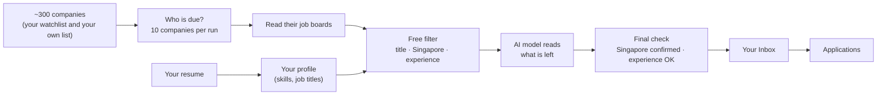
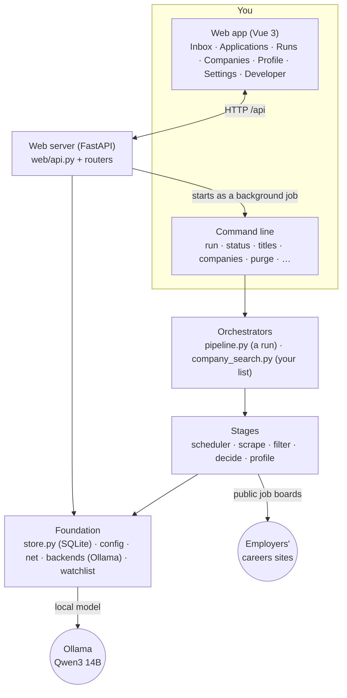

# JobScraper — overview

*How the app works, what it can do, and how the pieces fit together. Start here.
The full specification and the record of every change live in the PRD
(`.claude/prds/jobscraper-v2.prd.md`); this page is the short version.*

---

## In one minute

Looking for a job at specific companies means checking each company's careers
site again and again, and reading every posting to find the few that fit.
**JobScraper does that for you.**

You give it your resume and the companies you care about. It checks their
careers sites on a schedule, throws away everything that clearly doesn't fit,
asks an AI model to read what's left, and shows you a short list of
**new-graduate and early-career roles based in Singapore** that match you —
with the full job description, a link to apply, and a place to track every
application.

It runs on your own computer. Your resume and your application history never
leave it, and the AI model runs locally too — no account, no subscription,
no API key.

**Today:** about 300 companies watched, tens of thousands of postings read, and
only the few hundred that fit ever reach you.

---

## A week with JobScraper

1. **Open it** from the JobScraper icon on your desktop or taskbar. It opens in
   its own window, like any app.
2. **Start a run** from the Runs tab. Each run checks the companies that are due
   (10 at a time by default) and adds any new matches to your Inbox.
3. **Go through the Inbox.** Each role shows the company, location, experience
   asked for, *why it matches you*, and the full job description.
4. **Act on each role:**
   - **Apply on company site** — opens the posting in your normal browser, with
     your saved details for autofill. Afterwards the app asks whether you applied.
   - **Mark applied** or **Save** — the role moves to Applications.
   - **Not interested** — the role moves to a section at the bottom of the Inbox
     and stays there, even after you restart.
5. **Track your applications** in the Applications tab, grouped by company, from
   saved to applied, interviewing, offer or rejected.
6. **Close the window** when you're done; the app shuts itself down.

Every company is checked again on a cycle you choose (weekly by default), so
the Inbox keeps filling with roles you haven't seen.

---

## How it finds your roles

In plain words:

| Step | What happens | Why it matters |
|---|---|---|
| **1. Your profile** | The AI model reads your resume once and pulls out your skills, the job titles that suit you and your experience. You can edit the titles and ask for suggestions. | Everything after this is matched against *you*, not a generic profile. |
| **2. Who is due** | The app keeps a queue of companies. Each run takes the ones that have waited longest — 10 by default — and each company is re-checked every 7 days (you can choose 1, 3, 7, 14 or 30). | Every company gets checked regularly without one huge, slow run. |
| **3. Read the job boards** | It reads each company's jobs straight from its hiring system — Greenhouse, Lever, Ashby, SmartRecruiters, Workable, Recruitee, Workday — or from its own careers page. | Postings come from the employer itself: no agencies, no copies from job boards. |
| **4. Free filter** | Simple rules drop what clearly doesn't fit: senior, lead and management titles (product, project and program manager roles are kept), internships, sales, marketing, recruiting, legal and HR roles, titles that match none of your job titles, anything not explicitly in Singapore (remote too), and roles asking for more than 3 years' experience. | This removes over 99% of postings at no cost, so the AI only reads the plausible ones. |
| **5. The AI reads** | A local AI model (Qwen3, run by Ollama on your computer) reads a short extract of each remaining posting and decides whether it fits you and the kinds of roles you are open to, why, whether it is in Singapore and how much experience it asks for. | It catches what simple rules can't: whether the work actually suits you. |
| **6. Final check** | Code, not the AI, makes the last call: a role is kept only if it is confirmed Singapore and within the experience limit. | The AI can't let a wrong location or a senior role slip through. |

Each answer is remembered, so a posting is never read or judged twice unless it
changes.

---

## The app, tab by tab

### Inbox — new roles to go through
- A list on the left, the selected role in full on the right (one at a time on a phone).
- **Why it matches**, the experience asked for, where it is, when it was found.
- **About the job**: the full description as the employer wrote it, with Show more.
- **Apply on company site**, **Mark applied**, **Save**, **Not interested** —
  each with an Undo.
- **Not interested** roles collect in their own section at the bottom, which you
  can fold away; "Move back to new roles" undoes it.
- Search, sort (newest, company A–Z, your own company order) and choose which
  runs to show: all, the past week, the past month, or specific runs.
- A role you already track is never shown again as new — including the same
  posting listed under a second company name.

### Applications — everything you've acted on
- Grouped by company, with a strip showing how many are saved, applied,
  interviewing, offered or closed.
- Change a status in one click; every change is kept as a timeline.

### Runs — what each run found
- Start a run (or a test run that changes nothing), see that it is running, and
  the history of every run: date, companies checked, postings read, matches,
  status.
- Tick runs to show just those in the Inbox.

### Companies — your own list of employers
- Drop in a text or Word file of company names, one per line, most wanted first.
- The app finds each company's careers site (the AI suggests it, the app proves
  there is a real job board behind it) and starts watching the ones it finds.
- Each company shows found, already watched, failed (and why) or waiting;
  download the found and failed lists, or a full report.
- **Your watched companies**: how many can be scanned and how many failed their
  last check, with a CSV of all of them.

### Profile — you, as the app sees you
- Upload a new resume (PDF or Word); the profile is rebuilt from it.
- **Job titles** to search for, and **Recommend titles**: five new suggestions
  each time, based on your degree, internships and interests — never one it
  suggested before.

### Settings
- How many companies each run checks, and how often every company is re-checked.

### Developer
- The background job's live log, and Cancel — for when you want to see exactly
  what a run is doing.

---

## What stays on your computer

- **Your data stays local.** The resume, your profile, every application and its
  history are stored on your computer only. The project's code is public; your
  data is never in it.
- **The AI runs locally.** The model runs on your own computer through Ollama —
  no cloud AI service, no key, no cost per use.
- **It reads public pages only, politely.** It reads employers' public job
  listings, waits between requests, respects sites that ask not to be crawled,
  and never logs in anywhere. It does not scrape LinkedIn.
- **It tidies up after itself.** Job descriptions you'll never look at are
  deleted after 7 days to keep the database small; descriptions of roles in your
  Inbox or Applications are kept.

---

## How to open and use it

| You want to | Do this |
|---|---|
| Open the app | Click the **JobScraper** icon (desktop, Start menu or taskbar). Close its window to stop it. |
| Check for new roles | Runs tab → Start run, then the Inbox. |
| Add companies | Companies tab → drop in a list, or edit `config/watchlist.yaml`. |
| Update your resume | Profile tab → upload it. |
| Use the command line | `python -m jobscraper <command>` with `PYTHONPATH=src` — see the README's command table. |

Setting it up on a new computer is in the [README](../README.md).

---

## How the pieces link together

*For readers who want the technical picture.*

- **One process, two faces.** `python -m jobscraper web` serves both the web app
  (built files committed under `src/jobscraper/web/static/`) and its API under
  `/api`. The desktop icon starts it hidden and opens it in its own window.
- **The web server never does slow work itself.** A run, a profile refresh, title
  recommendations or a company search is started as a background job (the same
  CLI command), one at a time; the web app follows it and the Developer tab shows
  its log.
- **Clear layers.** Orchestrators (`pipeline.py`, `company_search.py`) wire the
  stages together; stages never call each other; `store.py` is the only code
  that talks to the database; `backends.py` is the only code that talks to the
  model. A test (`tests/test_layering.py`) enforces this.
- **Everything is remembered by content.** Filter verdicts are keyed by the rules
  and your job titles; AI decisions by your profile version and the posting's
  extract. Changing a rule re-checks postings for free; nothing is judged twice.
- **Files you own vs files it owns.** You edit `config/watchlist.yaml`,
  `config/rules.yaml`, `config/config.yaml` and your resume; the app owns
  `data/jobscraper.db` (your history — back it up), `data/shortlist.json` and
  `data/profile.derived.yaml`.
- **Tested.** About 320 Python tests and 160 web-app tests run on every change
  (`python tests/run_tests.py`, `cd web; npx vitest run`).

---

## Where to read more

| Document | What's in it |
|---|---|
| [README](../README.md) | Setup, commands, configuration. |
| [docs/DESIGN.md](DESIGN.md) | The architecture diagrams and the decisions behind them. |
| `.claude/prds/jobscraper-v2.prd.md` | The full specification and the build record of every milestone (M0–M17). |
| `jobscraper-cloud` repository | The plan for a hosted, multi-user version of JobScraper. |
